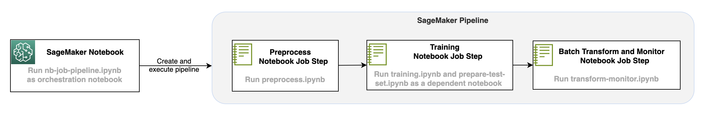

# RI-AIM366
This session covers Data Preparation at scale using SageMaker Studio with EMR and also optionally Glue Interactive Sessions.

## Setup
To get started with the notebooks first make sure to deploy the yaml file as a CloudFormation (CFN) stack. This stack creates a SageMaker Studio Domain and User. Once created you can go into SageMaker Studio and provision an EMR Cluster via the Service Catalog. You can also optionally connect to an existing EMR Cluster if you already have one.

## Solution Architecture

## References/Credits/Additional Resources

- [EMR Studio Service Catalog Templates](https://github.com/aws-samples/sagemaker-studio-emr/tree/main)
