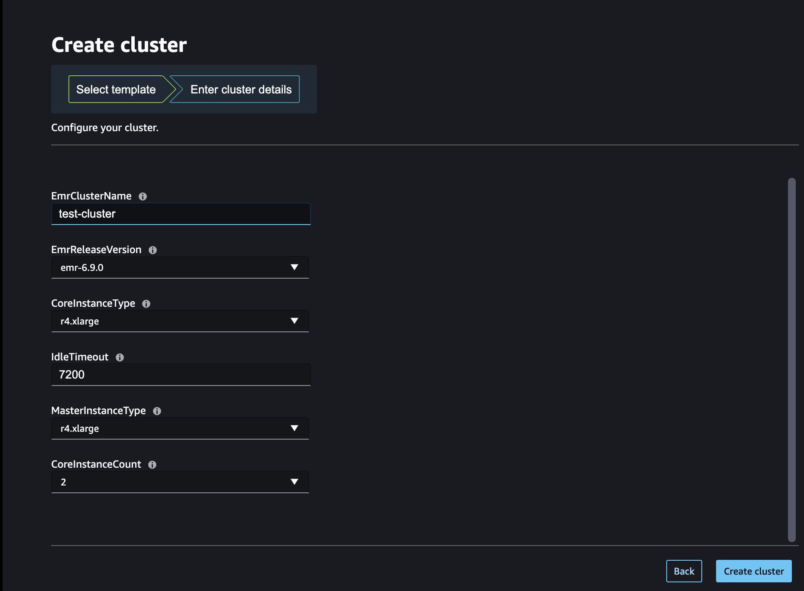
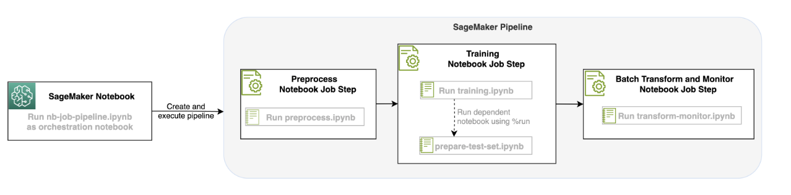

# RI-AIM366
This session covers Data Preparation at scale using SageMaker Studio with EMR and also optionally Glue Interactive Sessions.

## Setup
To get started with the notebooks first make sure to deploy the yaml file as a CloudFormation (CFN) stack. This stack creates a SageMaker Studio Domain and User. Once created you can go into SageMaker Studio and provision an EMR Cluster via the Service Catalog. You can also optionally connect to an existing EMR Cluster if you already have one.

This whole process will take ~30 minutes (Studio and EMR cluster setup)

### Notebooks Guide

1. Create Studio Domain, VPC Setup, Service Catalog Setup for EMR Cluster using CloudFormation template: <b>CFN-SagemakerEMRNoAuthProductWithStudio-v3.yaml</b>, refer to original code [here](https://github.com/aws-samples/sagemaker-studio-emr/blob/main/cloudformation/getting_started/CFN-SagemakerEMRNoAuthProductWithStudio-v3.yaml).
2. Execute <b>spark-pipelines.ipynb</b>, this will connect to your EMR Cluster, run preprocessing and create a SageMaker Pipeline that executes the following notebook as Notebook Jobs to demonstrate an end to end ML workflow:
   - <b>preprocessing.ipynb</b>
   - <b>training.ipynb</b>
   - <b>transform-monitor.ipynb</b>

## Solution Architecture
Once you have connected to your EMR cluster, we can perform preprocessing with Spark on Studio. You can also optionally use Spark via Glue Interactive Sessions. For this ML use-case we take the SST2 Text Classification dataset and use Transformers BERT for fine-tuning and deployment. Our entire ML workflow consists of preprocessing, local training, base model deployment, and monitoring setup. We orchestrate this workflow using SageMaker Pipelines and utilize SageMaker Notebook Job Steps to capture each ML lifecycle step as reflected in the following diagram:

## References/Credits/Additional Resources

- [EMR Studio Service Catalog Templates](https://github.com/aws-samples/sagemaker-studio-emr/tree/main)
